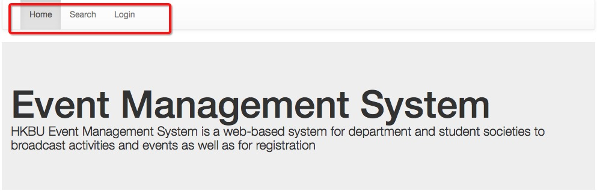
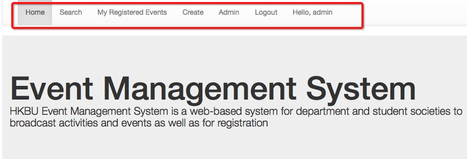
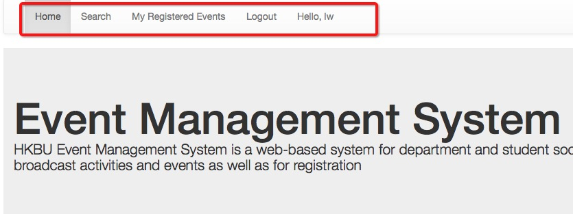
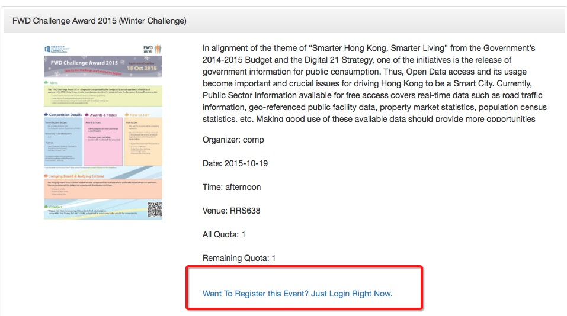
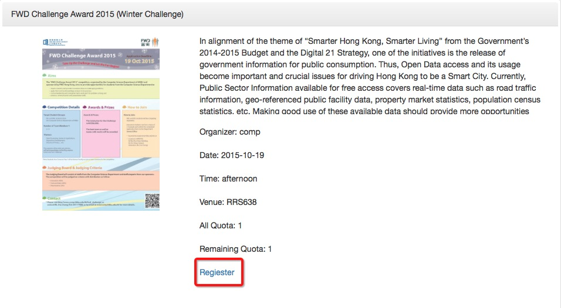
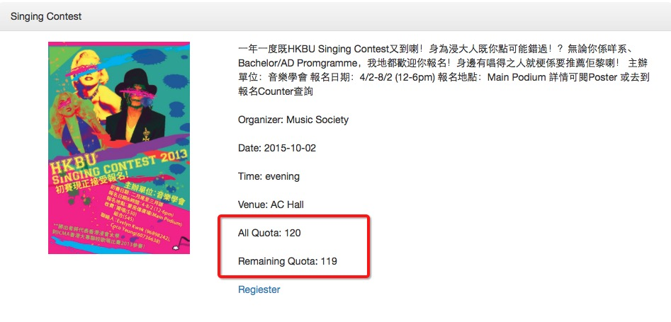
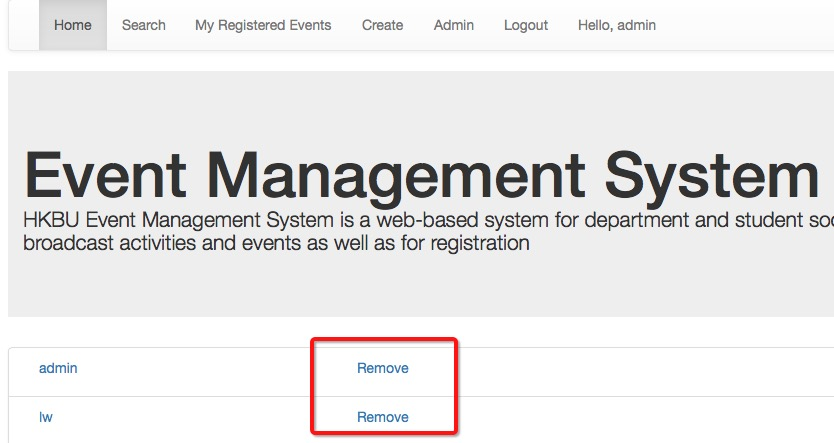
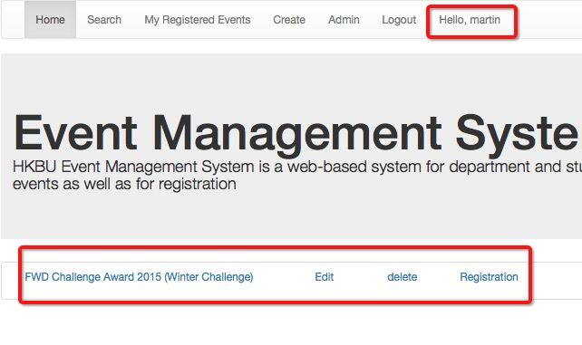

# A HKBU event registration system

This event registration system allow students in HKBU to sign up an personal account and register different events from different department.

This system has two parts:App and Web.

Both of Them provide those functions:

**1.login/logout**

**2.register an event**

**3.unregister an event**

**4.show registered events of a logged-in user.**

## User account in this system

Here I provide 3 different type of users

**super administrator**  

username:admin    password:123456

**administrator from different department**

username:martin   password:123456

**student user**

username:lw   password:123456    or you can register your own account

# Bonus achieved in this system

## Bonus on web

### 1. Different navigation bar based on the login-status

####Guest Mode

####Admin Mode

####User Mode

To achieve this, I use js in layout.ejs and add the different account type into session in login.js.

Actually, different accounts have different type:

In bootstrap.js, I add different **type** into different account.

As super admin, it's type is **"1"**.

As normal admin, it's type is **"2"** and it's department is "comp".

As student user, it's type is **"3"** and when a student register an account, this account's type will be set as **"3"** automatically by **regiester** function 

Here is the code in **register function at Usercontroller**

~~~
register: function(req, res) {

        if (req.method == "POST") {
            req.body.User.Type = "3";

            User.create(req.body.User).exec( function(err, model) {

                return res.send("Successfully Created!");

            });
        }

        else {

            return res.view('user/register');
        }
    }
~~~

Here is the code in **bootstrap.js**

~~~
var user = {"username": "admin", "password":"123456", "id":1,"type":"1"}

    User.create(user).exec( function (err, model)  {});

    user = {"username": "martin", "password":"123456", "id":2,"type":"2","org":"comp"}

    User.create(user).exec( function (err, model)  {});	

     user = {"username": "lw", "password":"123456", "id":3,"type":"3"}
      User.create(user).exec( function (err, model)  {}); 
~~~

Here is the code in **layout.ejs**

~~~

~~~
Here is the code in **login.js at Usercontroller**

~~~
	login: function (req, res) {

        if (req.method == "GET")
            return res.view('user/login');
        else {

            sails.log(req.body);
            sails.log(req.body.username);
			  User.findOne({username:req.body.username})
            .exec( function (err, user) {

                if (user == null) 
                    return res.send("No such user");
                
                if (user.password != req.body.password) 
                    return res.send("Wrong Password");
                    req.session.username = req.body.username;  
                    req.session.user_id = user.id;   
                    req.session.usertype = user.type;
                    req.session.org = user.org;
                  if(req.body.type=="1")
                {  
                    return res.json(user);
                }
                else
                {
                    return res.redirect("BuAdmin/index");
                }
            })
            
        }
    }
~~~

###2. Different status in event detail page

####Guest Mode

####User Mode

To achieve this, I add js in detail.ejs

~~~

<a id="reg"  href="/buadmin/addBeReg/<%=model.id%>">Regiester</a>

 

<a id="login" href="/user/login">Want To Register this Event? Just Login Right Now.</a>
					
				
 
~~~

###3. Show the remaining quota in event detail page

To achieve this,I calculate the remaining quota in **BuAdminController's detail function** and show it in **detail.ejs**

Here is the code

~~~
	detail: function (req, res) {

 		BuAdmin.findOne(req.params.id).populateAll().exec( function(err, model) {

 			if (model != null)
      {
        sails.log(model.beReg.length);
         sails.log(model.beReg);
        model.quota_usable = model.quota-model.beReg.length;
 				return res.view('detail', {'model': model});
      }
 			else
 				return res.send("Event Error");

 		});

 	}
~~~

###4. Admin account has right to remove the registered user from event

The event administrator can remove the registered user at the register page by clicking the link.

the url in this system just like that:

**http://localhost:1337/buadmin/removeuser/event_id?uid=user_id**

Here is the **removeuser** function code in Buadmincontroller

~~~
removeuser: function (req, res) {

    BuAdmin.findOne(req.params.id).exec( function (err, model) {

      if (model !== null) {
        model.beReg.remove(req.query.uid);
        model.save();
        return res.send("Event removed!");
      }
      else {
        return res.send("Event not found!");
      }
    })
    
  }
~~~

###5.Policies Control

In this system,normal account like stduents are not allowed to get or post data to serval functions(like remove register function). In order to prevent these accidents，I add policies control into sails.

At **config/locales/policies.ejs**, I added the restrictive policies to different functions at BuAdminController

~~~
 BuAdminController: {

    admin:'isAdmin',
    create: 'isAdmin',
    removeuser:'isAdmin',
    showReger:'isAdmin'
    

  }
~~~

###6. Different admin account can control its own department event only.

Here is the code to achieve this function

~~~
admin: function(req, res) {

    if(req.session.usertype=="1")
    {
     åBuAdmin.find().exec( function(err, models) {

      return res.view('admin', {'events': models});

    });
   }
   if(req.session.usertype=="2")
   {
     BuAdmin.find().where({organizer:req.session.org}).exec( function(err, models) {

      return res.view('admin', {'events': models});
    });
   }
 }
~~~

---

---

## Bonus on App

###1. Real-time event status change

At the event detail page, the right button shows different status

When users haven't logined:

When users have registered the event:

To achieve this function, I add an onfocus function to window at detail_page.js

~~~
function getRegStatus(e) {
	if(Alloy.Globals.log_control!=null)
	{
		Alloy.Collections.myreg.fetch({
			
			success:function(){
				
				var change = Alloy.Collections.myreg.where({
				id : fid
			});
			console.log(JSON.stringify(change));
			if (change.length >= 1)
			{
				$.reg_button.title = "UnReg";
			}
			else
			{
				$.reg_button.title = "Reg";
}
				
				}
			
		});
			
		}
		else
		{
			$.reg_button.title ="Login";
		}

};
~~~

The model which use to get the register-event list also refresh at the same time by add:

~~~

"deleteAllOnFetch": true

~~~ 

###2. Get different data from sails by using type in url or post data.

App and web both use same api provided by sails. But the data returned from api just fetch the web and can't be read by app. To solve this problem, I add the **type=1** at app's login function and model

login:

~~~
var loginReq = Titanium.Network.createHTTPClient();
	if ($.username.value != '' && $.username.value != '') {
		loginReq.open('POST', 'http://localhost:1337/User/login');

		loginReq.send({
			username : $.username.value,
			password : $.password.value,
			type : 1
		});
	}
~~~

model

~~~
"URL":"http://localhost:1337/User/showReg?type=1",
~~~

the sails recieve the type and return different data:

~~~
if(req.body.type=="1")
                {  
                    return res.json(user);
                }
                else
                {
                    return res.redirect("BuAdmin/index");
                }
~~~